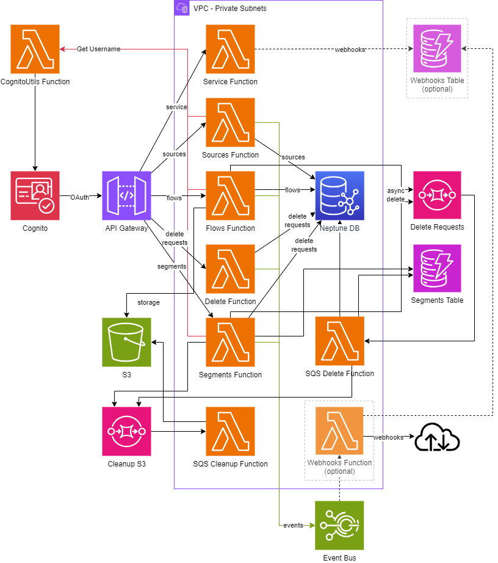

# Time-addressable Media Store implementation

This solution deploys the AWS Infrastructure required to create a sample implementation of the [BBC TAMS API](https://github.com/bbc/tams).

## Pre-requisites

Before deploying this solution a CloudWatch log role ARN needs to be created and API Gateway configured to make use of it in your chosen region.

- [Create the required IAM role](https://docs.aws.amazon.com/apigateway/latest/developerguide/set-up-logging.html?icmpid=apigateway_console_help#set-up-access-logging-permissions)
- [Set up API Gateway to use this role](https://docs.aws.amazon.com/apigateway/latest/developerguide/set-up-logging.html?icmpid=apigateway_console_help#set-up-access-logging-using-console)

### Verify your VPC configuration

If you choose the option to deploy the solution in an existing VPC, you must ensure that the TAMS API Lambda functions running in the private subnets of your VPC can connect to other AWS services. This can be achieved with [NAT gateways](https://docs.aws.amazon.com/vpc/latest/userguide/vpc-nat-gateway.html). However, this solution does not require internet access as long the required [VPC Endpoints](https://docs.aws.amazon.com/whitepapers/latest/aws-privatelink/what-are-vpc-endpoints.html) are available.

#### VPC Endpoints

If you choose to let this solution deploy a new VPC all the required VPC Endpoints will be created automatically.

If you are choosing to use an existing VPC then you should ensure that the subnets being supplied are able to access the internet or ensure you have the following VPC Endpoints in place:

| Service  | Endpoint Type |
| -------- | ------------- |
| s3       | Gateway       |
| dynamodb | Gateway       |
| sqs      | Interface     |
| events   | Interface     |
| ssm      | Interface     |
| lambda   | Interface     |

## Deploy the sample application

The Serverless Application Model Command Line Interface (SAM CLI) is an extension of the AWS CLI that adds functionality for building and testing Lambda applications. It uses Docker to run your functions in an Amazon Linux environment that matches Lambda. It can also emulate your application's build environment and API.

To use the SAM CLI, you need the following tools.

- SAM CLI - [Install the SAM CLI](https://docs.aws.amazon.com/serverless-application-model/latest/developerguide/serverless-sam-cli-install.html)
- Docker - [Install Docker community edition](https://hub.docker.com/search/?type=edition&offering=community)

To build and deploy your application for the first time, run the following in your shell:

```bash
sam build --use-container
sam deploy --guided
```

**NOTE: The Neptune database takes approximately 20mins to create. Neptune also requires a VPC which is why there are VPC parameters mentioned below.**

The first command will build the source of your application. The second command will package and deploy your application to AWS, with a series of prompts:

- **Stack Name**: The name of the stack to deploy to CloudFormation. This should be unique to your account and region, and a good starting point would be something matching your project name.
- **AWS Region**: The AWS region you want to deploy your app to.
- **EnableWebhooks**: Specify whether you want the solution deployed with Webhooks.
- **VpcId**: Specify an existing VPC Id, leave blank to have one created.
- **VpcAZs**: Specify a comma-separated list of availability zones (for example `us-east-1a,us-east-1b`) to use when a VPC is specified. The number of AZs must match the number of private subnets specified in PrivateSubnetIds. Leave blank if VPC being created.
- **PrivateSubnetIds**: Specify a comma-delimited list of the Private Subnet Ids to be used in the existing VPC.
- **NeptuneServerlessConfiguration**: Neptune Serverless Scaling Configuration. Must be a list of two values, MinCapacity and MaxCapacity, separated by commas. Valid values between 1–128.
- **DeployWaf**: Specify whether you want the solution behind a WAF.
- **Confirm changes before deploy**: If set to yes, any change sets will be shown to you before execution for manual review. If set to no, the AWS SAM CLI will automatically deploy application changes.
- **Allow SAM CLI IAM role creation**: Many AWS SAM templates, including this example, create AWS IAM roles required for the AWS Lambda function(s) included to access AWS services. By default, these are scoped down to minimum required permissions. To deploy an AWS CloudFormation stack which creates or modifies IAM roles, the `CAPABILITY_IAM` value for `capabilities` must be provided. If permission isn't provided through this prompt, to deploy this example you must explicitly pass `--capabilities CAPABILITY_IAM` to the `sam deploy` command.
- **Save arguments to samconfig.toml**: If set to yes, your choices will be saved to a configuration file inside the project, so that in the future you can just re-run `sam deploy` without parameters to deploy changes to your application.

You can find your API Gateway Endpoint URL in the output values displayed after deployment.

## Usage

**Note:** An associated repository [time-addressable-media-store-tools](https://github.com/aws-samples/time-addressable-media-store-tools) is available to be used as a sample to give you a basic Web UI to help visualize your TAMS Store.

Access to the API is controlled by Cognito. The solution comes with an App Client already created for you. If required, you can create others for differing access patterns as required.

Whether you are using the pre-configured App Client or whether you create your own, you will need to authenticate with the API using an `Authorization` header. The header follows the traditional `Bearer {token}` syntax.

The guide below assumes you are using **Client credentials** [OAuth 2.0 grant](https://docs.aws.amazon.com/cognito/latest/developerguide/federation-endpoints-oauth-grants.html) for "machine-to-machine" access using the pre-configured App Client. It also describes how to generate the access token you will need to place in the header.

To request an access token, you will require 4 pieces of information:

- **Client Id**: This can be retrieved from the Outputs of the Cloudformation Stack created during deployment or by browsing to the Cognito User Pool console and locating the App Client named `server-to-server`.

- **Client Secret**: This can be retrieved from the Cognito User Pool console and locating the App Client named `server-to-server`. Click on this App Client to view its details and you will see an option to copy the Client secret.
**NOTE: This Client secret is confidential, and care should be taken to store this value securely so that 3rd parties are not able to access it.**

- **Token URL**: This can be retrieved from the Outputs of the Cloudformation Stack created during deployment.

- **OAuth scope(s)**: Access to API methods is controlled by specific scopes. The options available are:
  - tams-api/read - required for GET and HEAD methods
  - tams-api/write - required for PUT and POST methods
  - tams-api/delete - required for DELETE methods

    **NOTE: Supplying more than one scope is allowed, it just means the resulting token will be able to call a combination of allowed methods.**

To request a token, you need to `POST` to the `TOKEN Url`:

```bash
curl -X POST -d 'client_id=XXX&client_secret=XXX&grant_type=client_credentials&scope=tams-api/read' https://XXXXX
```

This request will return JSON that will contain the `access_token`. Take the value of this token and create the `Authorization` header. Pass this header on all requests to the API to be authenticated.

Currently Authorization is purely handled by which OAuth scopes are assigned to the App Client within Cognito. Creating a new client with only `tams-api/read` will result in "read only" access to the API.

## Architecture Diagram



## Cleanup

To delete the solution, use the SAM CLI, you can run the following:

```bash
sam delete
```

> **After using `sam delete` the S3 Bucket and DynamoDB table(s) will still need to be deleted manually via the AWS Console if you do not want to retain the data.**

## Security

See [CONTRIBUTING](CONTRIBUTING.md#security-issue-notifications) for more information.

## License

This library is licensed under the MIT-0 License. See the LICENSE file.
